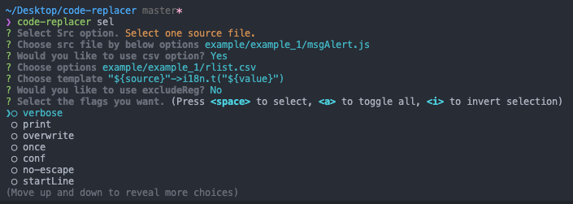

# Code-replacer

[](https://travis-ci.com/jopemachine/code-replacer)

**Table of Contents**

## Installation

* code-replacer

```
npm i -g code-replacer
```

* [code-replacer-vscode-plugin](https://github.com/jopemachine/code-replacer-vscode-plugin)

If you like the idea of code-replacer, how about trying to use vscode plugin?

## How to use

* On cli

1. Write `csv` file to replace text or `template` to change your codes.

2. Type the command

3. Output files is `__replacer__.{original file name}`.

* On cli, using [inquirer](https://github.com/SBoudrias/Inquirer.js)

you can use `inquirer`'s cli menu to select options.




* On vscode

See [code-replacer-vscode-plugin](https://github.com/jopemachine/code-replacer-vscode-plugin).

## Simple example

### Example 1, use `csv` and `template`

Pass the path of the input file to the `csv` option if you need it.

For example, if you wanna change `Some message..` to `alert(i18n.t("some_msg"))` for support i18n (supporting multi language feature), you can do this.

```js
// Original code, Assume this file path is ./msgAlert.js

...
alert("Some message..");
alert("Blah blah..");
...
```

Below is the input file (`csv`).

Note that `source` column is Message string including double quotes and `value` column is corresponding string key.

```
source,value
Some message..,some_msg
Blah blah..,blah_blah
```

And you need to forward some `template` value.

We assume this value is `i18n.t(${value})`.

In `template` option, `${var}` option means column data named `var`.

On each line in the source file (`msgAlert.js`), you can insert data in the csv column with the corresponding variable.

Then type the template as a form of `A->B`.

So the `template` value we need to forward is as follows.

```
"${source}"->i18n.t("${value}")
```

So if you type below command into the console,

```
code-replacer --src='example/example_1/msgAlert.js' --csv='example/example_1/rlist.csv' --template='"${source}"->i18n.t("${value}")'
```

Then you can get to below file.

```js
// This file name is __replacer__.msgAlert.js

...
alert(i18n.t("some_msg"));
alert(i18n.t("blah_blah"));
...
```

For more detailed instructions, see the topic `Options`.

### Example 2, use only `template`

In certain situations, key, value pairs may not be required to change the string.

For example, if you need to replace all of *require* below with *import* statements,

(Whether it works or not)

We assume in this, the argument of require is `$[key]`. 

(You can name it `$[someKey1]` or `$[otherKey]` or other name (`Alphabet`, `Numeric` Available))

So, you can use this template. `require("$[key]")->import $[key] from "$[key]"`

```js
...
require("abc");
import def from "def";
require("ghi");
...
```

Then, the command is as follows.

```
code-replacer --src='./example/example_2/index.js' --template='require("$[key]")->import $[key] from "$[key]"'
```

And you can get below file.

```js
...
import abc from "abc";
import def from "def";
import ghi from "ghi";
...
```

### Example 3, use csv's multiple column

Multiple column data from the csv file are available in the following ways.

```
code-replacer --src='example/example_3/index.js' --csv='example/example_3/rlist.csv' --template='${source}${index}-><div id="${id}" class="${class}" />'
```

### Example 4, use csv's multiple value 

```
code-replacer --src='example/example_4/index.js' --csv='example/example_4/rlist.csv' --template='$[key1] ${source}${index} $[key2]->$[key2] ${index}${source} $[key1]'
```


## Tips

1. If there are more than one matching key, (which contain other key in the rlist.csv (e.g. test, tester)), 
The longest key is selected (replaced) basically. 
If you don't want this situation, try to give `conf` option and skip the longest one, then you can choose next candidate (test).

2. Key values in the `rlist.csv` and left side of `template` are treated as *regular expression*. But special characters are escaped automatically.
So, no separate escape processing is required.

3. In `template` option, The `template` value is treated as a form of `A->B`
If A should contains `->` (arrow signature), you can escape that `->` by `\->`.

4. You can apply the `excludeReg` option as form of regular expression, to exclude lines that you don't want to replace, such as comments.
(e.g. `x=(.*//.*)|(.*<!--.*)|(.*\/\*.*)`)

5. If you feel inconvenient to enter template value or option value each time, you can set some values you want as default by below way.
`code-replacer set --tem={some_value} -x -v --debug --src={some_value} ...`
If these argument is not entered next time, these values are used as a default.

And you can also check the default values with the command below.

```
code-replacer default
```

## Options

#### --dir (-d)
type: `string`

specify source file's directory
Files beginning with `__replacer__.` are excluded from the source files.

#### --ext, -e
type: `string`

specify source file's extension.
(Use this with `dir` option to target multiple files at once)

#### --src, -s
type: `string`

specify source code file.
when `src` and `dir` are given,
target the files corresponding to the name in the target directory.
(no need to specify `ext` separately)

#### --csv
type: `string`

specify csv file,
default value is `./rlist.csv`

And when you specify `dir` option, name `./rlist_{fileName}.csv`, to apply different rlist files per file.

#### --dst, -dst
type: `string`

specify the name of the output file. 
default value is `__replaced__.{originalFileName}`.

#### --verbose, -v
type: `boolean`

print all information about the text replaced in console.
default is 'false'

#### --debug
type: `boolean`

outputs debugging information to the `DEBUG_INFO` file

#### --once, -o
type: `boolean`

even if there are multiple substitution values in a line,
they are replaced only once.

#### --startLine, -sl
type: `string`

apply replace from that line.

#### --endLine, -el
type: `string`

specify end line pattern.

#### --conf, -c
type: `boolean`

check the string values that you want to replace on each line.

#### --template, --tem
type: `string`

specify template.
see example for details.

#### --overwrite, -o
type: `boolean`

overwrite the source file.

#### --excludeReg, -x
type: `boolean`

specify the regular expression of the line
to be excluded from the replace.