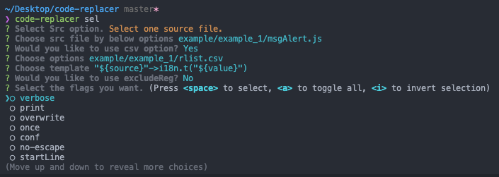
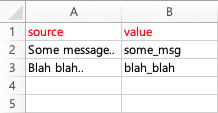
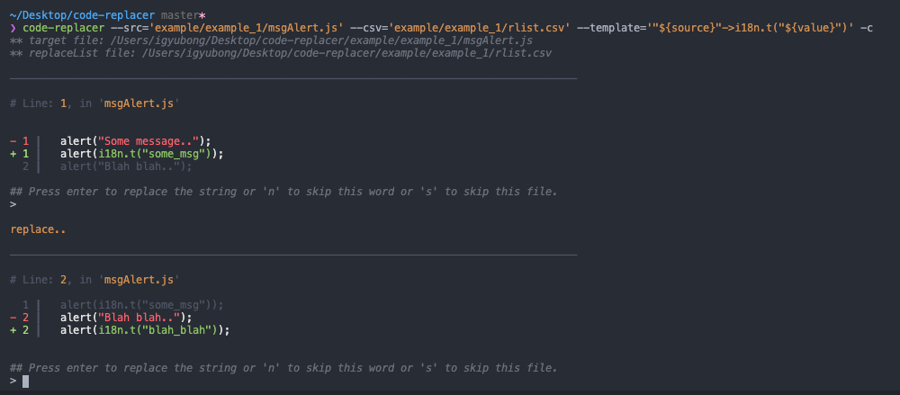
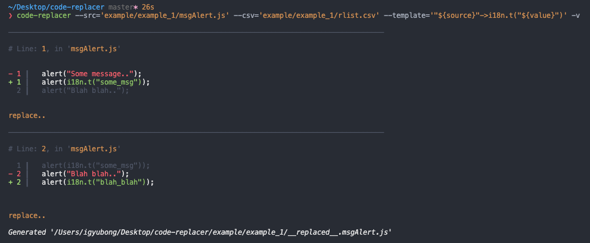
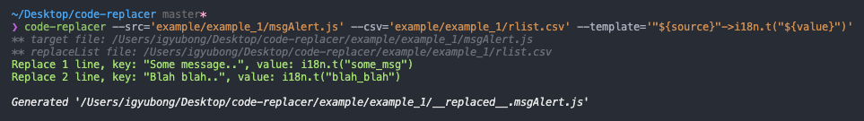

# Code-replacer

[![NPM version][npm-image]][npm-url]
[](https://travis-ci.com/jopemachine/code-replacer)
[](undefined)
[](https://www.codefactor.io/repository/github/jopemachine/code-replacer)

[npm-url]: https://npmjs.org/package/code-replacer
[npm-image]: https://img.shields.io/npm/v/code-replacer.svg

Replace codes line by line with regex for target files

**Table of Contents**

- [1. How to install](#installation)
- [2. How to use](#how-to-use)
    - [2.1 On Cli](#on-cli)
    - [2.2 On Cli using inquirer](#on-cli-using-inquirer)
    - [2.3 Using vscode plugin](#on-vscode)
- [3. Terms description](#terms-description)
- [4. Examples](#simple-example)
    - [4.1 Example 1, using csv column key and template](#example-1)
    - [4.2 Example 2, using only template](#example-2)
    - [4.3 Example 3, using multiple csv column keys](#example-3)
    - [4.4 Example 4, using multiple csv column keys with left reference keys](#example-4)
- [5. Tips](#tips)
- [6. Options](#options)
- [7. Bug Reporting](#bug-reporting)

## Installation

* code-replacer

```
npm i -g code-replacer
```

* [code-replacer-vscode-plugin](https://github.com/jopemachine/code-replacer-vscode-plugin)

If you like the idea of code-replacer, how about trying to use vscode plugin?

If it's annoying to type options every time, this plugin might help you.

## Development environment

Tested on `Windows 10`, `macos Catalina`

## How to use

### On cli

1. Write `csv` file to replace text or `template` to change your codes.

2. Specify options you want to apply.

3. Output files is `__replaced__.{original file name}`.

### On cli using inquirer

You can use `inquirer`'s cli menu to select options.




### On vscode

See [code-replacer-vscode-plugin](https://github.com/jopemachine/code-replacer-vscode-plugin).

## Terms description

To help you understand how to use this program, here is some description of terms.

1. **template**

`template` is a string indicating which value in the code is to be replaced with which value.

For example, `A->B` option replace *A* with *B*.

And for convenience, in this document, A is `templateLvalue` (string to be replaced), B is `templateRvalue` (string after replacing).

2. **rlist.csv**

* If you do not give the csv option, code-replacer uses the `rlist.csv` file **in src file's directory** as `csv` option.

* If you use the dir option, the `rlist_${fileName}.csv` file will be used as a csv option.

* If the csv file is not found, replace code with only the template value.

3. **${key}**

Above key is treated as `csv column key`.

key is replaced with csv file's column data.

Therefore, the key must be used with the csv option.

And `templateLvalue` must include this key because this program should know which value should be replaced with which value with this csv file.

See `Examples` for examples of use.

Note that the key can contain only **alphabetic and numeric characters.**

And if the csv columns does not have this "key" column, it is treated as a string matching.

4. **$[key]**

Above key is treated as `left reference key`.

In fact, this key is replaced with regexp's group key `([\d\w]+)`.

So, you can refer `templateLvalue`'s substring at `templateRvalue` using this like below example.

```
-t='require("$[key]")->import $[key] from "$[key]"'
```

And along with the `no-escape` option, you can refer regexp's group key like below example.

```
-t='(?<first>[0-9]{3})(?<second>[0-9]{4})(?<third>[0-9]{4})->$[first]-$[second]-$[third]'
```

Note that the key can contain only alphabetic and numeric characters.

(And this applies for group keys of regexp)


## Simple example

### Example 1

Pass the path of the input file to the `csv` option if you need it.

For example, if you wanna change `Some message..` to `alert(i18n.t("some_msg"))` for support i18n (supporting multi language feature), you can do this.

```js
// Original code, Assume this file path is ./msgAlert.js

...
alert("Some message..");
alert("Blah blah..");
...
```

Below worksheet is the input file (`csv`).

Note that `source` column is Message string including double quotes and `value` column is corresponding string key.



And you need to forward some `template` value.

We assume this value is `i18n.t(${value})`.

In `template` option, `${value}` option means column data named `value`.

On each line in the source file (`msgAlert.js`), you can insert data in the csv column with the corresponding variable.

Then type the template as a form of `A->B`.

So the `template` value we need to forward is as follows.

```
"${source}"->i18n.t("${value}")
```

So if you type below command into the console,

```
code-replacer --src='example/example_1/msgAlert.js' --csv='example/example_1/rlist.csv' --template='"${source}"->i18n.t("${value}")'
```

Then you can get to below file.

```js
// This file name is __replaced__.msgAlert.js

...
alert(i18n.t("some_msg"));
alert(i18n.t("blah_blah"));
...
```

For more detailed instructions, see the topic `Options`.

### Example 2

In certain situations, key, value pairs may not be required to change the string.

For example, if you need to replace all of *require* below with *import* statements,

We assume in this, the argument of require is `$[key]`. 

(You can name it `$[someKey1]` or `$[otherKey]` or other name (`Alphabet`, `Numeric` Available))

So, you can use this template. `require("$[key]")->import $[key] from "$[key]"`

```js
...
require("abc");
import def from "def";
require("ghi");
...
```

Then, the command is as follows.

```
code-replacer --src='./example/example_2/index.js' --template='require("$[key]")->import $[key] from "$[key]"'
```

And you can get below file.

```js
...
import abc from "abc";
import def from "def";
import ghi from "ghi";
...
```

### Example 3

Multiple `csv column key` are available in the following ways.

```
code-replacer --src='example/example_3/index.js' --csv='example/example_3/rlist.csv' --template='${source}${index}-><div id="${id}" class="${class}" />'
```

### Example 4

You can use the `csv column key` with the `left reference key`.

```
code-replacer --src='example/example_4/index.js' --csv='example/example_4/rlist.csv' --template='$[key1] ${source}${index} $[key2]->$[key2] ${index}${source} $[key1]'
```

## Tips

1. If there are more than one matching key, (which contain other key in the `rlist.csv` (e.g. test, tester)), 
The **longest** key is selected (replaced) basically. 
If you don't want these matching, give `conf` option and skip the longest one, then you can choose next candidate manually (test).

2. Left side of `template` are treated as *regular expression*. But special characters are escaped automatically.
So, no separate escape processing is required. If you want to use raw `RegExp`, you can use `no-escape` option.
you also can use `leftReference key` and `csv column key` with this option, too.

3. In `template` option, The `template` value is treated as a form of `A->B`
If A should contains `->` (arrow signature), you can escape that `->` by `\->`.

4. You can apply the `excludeReg` option as form of regular expression, to exclude lines that you don't want to replace, such as comments.
(e.g. `x=(.*//.*)|(.*<!--.*)|(.*\/\*.*)`)

5. If you feel inconvenient to enter template value or option value each time, you can set some values you want as default by below way.
`code-replacer set -t={some_value} -x -v --src={some_value} ...`
If these argument is not entered next time, these values are used as a default.

And you can also check the default values with the command below.

```
code-replacer default
```

And this vscode's plugin might helps.

[code-replacer-vscode-plugin](https://github.com/jopemachine/code-replacer-vscode-plugin).

## Options

#### --src, -s (required)
type: `string`

Specify source code file.
when `src` and `dir` are given,
target the files corresponding to the name in the target directory.
(no need to specify `ext` separately)

#### --template, --t (required)
type: `string`

Specify template.
See example for details.

#### --conf, -c
type: `boolean`

Check the string values that you want to replace on each line.

default is 'false'



#### --verbose, -v
type: `boolean`

Outputs information about replaced lines on the console.
default is 'false'



#### --print, -p
type: `boolean`

Outputs simple information about replaced lines on the console.
default is 'true'



#### --dir, -d
type: `string`

Specify source file's directory
Files beginning with `__replaced__.` are excluded from the source files.

#### --ext, -e
type: `string`

Specify source file's extension.
(Only use this with `dir` option to target multiple files at once)

#### --csv
type: `string`

Specify csv file,
Default value is `./rlist.csv`

And when you specify `dir` option, name `./rlist_{fileName}.csv`, to apply different rlist files per file.

#### --dst, -dst
type: `string`

Specify the name of the output file. 
default value is `__replaced__.{originalFileName}`.

#### --once, -o
type: `boolean`

Even if there are multiple substitution values in a line,
they are replaced only once at first.

default is 'false'

#### --startLine, -sl
type: `string`

Apply replacing from that line.

(startLine will be replaced)

#### --endLine, -el
type: `string`

Specify end line.

(endLine will not be replaced)

#### --overwrite, -o
type: `boolean`

Overwrite the source file.

It works the same as when you give dst the same value as src.

default is 'false'

#### --excludeReg, -x
type: `boolean`

Specify the regular expression of the line to be excluded from the replace.

Lines corresponding to the regular expression in regexp will not be replaced.

For example, comments might be excluded from replacement.

## Bug reporting

This program still appears to contain a lot of bugs.

Bug reports are always welcome